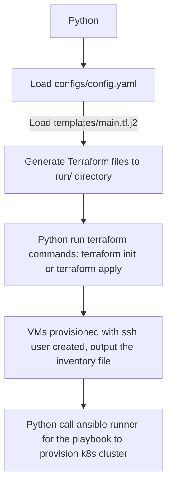

# Scripts:: Move the provision of the k8s cluster into a script

I am tired of writing documents step by step, let's move to the script to automate all of them we have done before.

The main reason is that I found the disk space is too small with the previous setup, and it makes it error prone to update the containerd runtime to store all the images and containers data to the small builtin space. So I need to attach a larger disk, then I need to update the memory as serving a LLM consumes quite a lot resources.

Make the whole process automatically can make me happy.

Let's provision the libvirt KVM based VMs using Terraform, and provision the kubernetes cluster using Ansible with selectable runtimes like:
* containerd or CRI-o
* Flannel or Calico
* iptables or ipvs with Flannel

etc.

## yaml for configurations and Python as start point
Yaml is a great option for configuration, the configurations will be in yaml format in the `configs/config.yaml` file

As Terraform's unique syntax on complex configurations setup, it would be a good choice to use Python as the start point to generate the Terraform files and call terraform commands to provision the infrastructures.

The basic flow is:

## Terraform for infrastructure provision

## Ansible for k8s packages installation, configurations and plugins before cluster initialization

